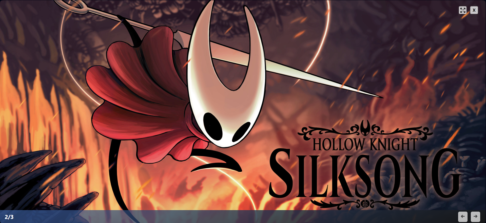

# SatellaSoft Gallery

**SatellaSoft Gallery** is an open source image gallery project, with the possibility of rewind/forward and modal display. The gallery also displays a text description and the current image number.

- Our site: **https://satellasoft.com**
- Author: **Gunnar Correa**



Click on the image to expand it.

# Add images

Using it is very simple, just insert your images inside the div whose class is ```ss-gallery-image```.

Note that images, in addition to the src which is a mandatory field, have the ```data-title``` field, it is based on the text of this attribute that will be displayed in the description.

``````

# JS config

In the ss-gallery.js file you will see some settings, including:

- ```delayTime```: How long it takes from one transition to the next;
- ```usingLazy```: Defines whether to use ```Lazyloading``` on images. This improves the gallery’s performance;
- ```showDesc```: Displays the description paragraph if ```true``` and ```false``` hides it;
- ```currentIndex```: What is the initial index of the gallery. Normally it is zero that represents the first image.

# CSS Config

If you want to adjust the size of the image displayed in the modal, simply change the value of the ```--max-image-width``` variable available in the ```ss-gallery.css``` file.
